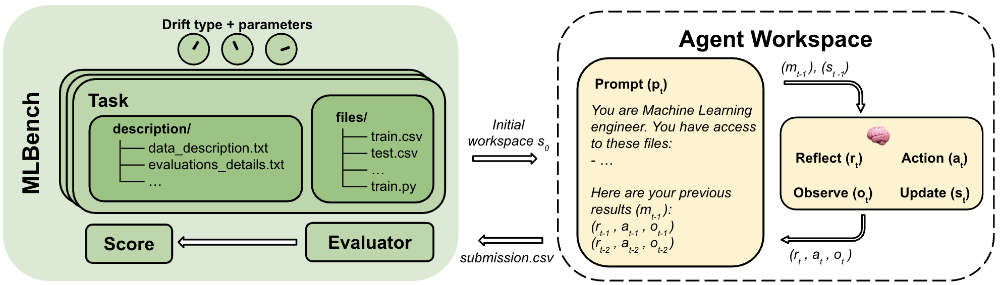

# DSC180A-Q1Project

## Overview
Our project aims to explore how to evaluate LLM systems with a focus on the context that shapes their performance. Rather than evaluating the models or agents directly, we are interested in studying the surrounding factors that influence outcomes, including prompts, tools, external data, and memory. Since this is a broad and relatively new area of research, our initial efforts have centered on developing a strong conceptual foundation and identifying feasible directions before beginning implementation.

## What We’ve Done (Weeks 1–5)
During the first two to three weeks, our group focused on reading existing papers and reviewing resources related to LLM evaluation. We studied existing metrics, benchmark designs, and evaluation frameworks to understand how performance is currently measured and what aspects of context are often overlooked. This background research helped us define the gaps that our project could address.

Then, we transitioned to idea generation and refinement. We began with five possible directions and met regularly with our mentor to discuss feedback and feasibility. Through several iterations, we narrowed these ideas to two promising approaches and conducted additional research to understand their potential. Eventually, we decided to combine both directions into a single, cohesive project.

A major reason why this process took additional time is the nature of our core research question: “How could or should we evaluate context?” This question represents an open challenge in the field, since there is currently no definitive answer or established approach. Because the Quarter 1 project is recreating an existing solution, it was difficult to find prior work that directly addresses our specific question. This required us to spend more time exploring the problem space and understanding where our contribution could fit.

## Task: ML Experimentation (Q1 Scope)
We evaluate agents **as ML experimenters**. An agent plans, writes code, calls tools, and manages files to complete compact ML tasks. Heavily inspired by Stanford's MLAgentBench (https://arxiv.org/pdf/2310.03302) and OpenAI's MLEBench (https://arxiv.org/pdf/2410.07095).



**Task format:**
- **Actions:** edit files, run tests/metrics, parse tracebacks, update prompt/tool/memory.
- **Modalities:** start with **text/tabular**; optional image/vision later.
- **Stop criteria:** produce a **valid structured output** (e.g., metrics JSON) or meet a **task-native target** (e.g., ≥10% over a starter baseline) within token/time/iteration budgets.

## Stucture (Placeholder)
As most of our work so far has been literature review and problem scoping, the code is currently just a placeholder. By the end of Q1, we aim to have a toy LLM system using the OpenAI SDK with a GPT-5 key, with an our layer of a context-only controller that updates/evaluates prompts, tool policy, and memory based on tests and metrics. Each run will generate a JSON of trace logs capturing the prompt/tool/memory usage, token counts, and timings. We will then evaluate this system on a lightweight ML-experimentation testbed (planning, coding, running checks, reading tracebacks) with deterministic splits and a pinned environment to measure context policies reliably.

- `code.py` contains library code — functions that will power a toy LLM system (soon via the OpenAI SDK with a GPT-5 key). For now, it exposes a minimal `run()` so the repo is executable.
- `config.json` contains parameters for the functions in `code.py` (e.g., model id, simple task input, basic budgets).
- `script.py` imports `code`, loads `config.json`, and calls functions from the `code` module. (This could also be a notebook, `script.ipynb`.)

Post checkpoint steps: Develop a **toy LLM system** using OpenAI SDK + GPT-5 key (as recommended by our mentor), then a small replication of a lightweight agent task to exercise the loop and metrics.

---

## Setup

```bash
python3 script.py --config config.json
```

### Environment Variables
- Copy the provided `.env` template (or create one) in the repo root. The code loads it automatically on import, so no manual `export` is needed. Keep this file untracked.

#### 1. Install dependencies
```bash
pip install openai arize-phoenix-otel
```

#### 2. Correct configuration

`.env` file required keys:
```
OPENAI_API_KEY=<OpenAI key>
PHOENIX_API_KEY=<system key from Phoenix dashboard (JWT-like)>
PHOENIX_PROJECT_NAME=toy-llm          # any descriptive label for grouping traces
PHOENIX_COLLECTOR_ENDPOINT=https://app.phoenix.arize.com/s/<space-id>/v1/traces
# Optional (legacy/custom collectors):
# PHOENIX_CLIENT_HEADERS="api_key%3Dphx-..."   # URL-encoded header for pre-Jun-24-2025 spaces
# PHOENIX_GRPC_PORT="4317"                     # override only if your collector runs elsewhere
```
- **API key**: Use a **System Key**, not a user key. Retrieve it from *Dashboard → Settings → API Keys* in Phoenix.  
- **Endpoint**: Copy the *Hostname* field and append `/v1/traces` for direct trace export (Cloud ingest is HTTP-only as of May 2025).  
- **Project name**: Any string; we default to `toy-llm` and reference it when filtering traces in Phoenix.

### Observability (Arize Phoenix)
Set `"telemetry": { "phoenix": { "enabled": true } }` in `config.json` (already true in the repo). During a run the system emits both local JSONL traces (`traces/run.jsonl`) and Phoenix spans (LLM API calls, iteration metadata, evaluations).

#### Phoenix setup & verification
1. **Create credentials**  
   - Sign in at [app.phoenix.arize.com](https://app.phoenix.arize.com/login).  
   - Create or select a *Space*, then open **Settings → API Keys**.  
   - Copy the *API Key* and *Hostname* (collector endpoint). If your space was created before **Jun 24, 2025**, also note the legacy API-header requirement described in the [Phoenix docs](https://arize.com/docs/phoenix/integrations/python/beeai/beeai-tracing-python).
2. **Populate `.env`**  
   - Add the following entries (quotes optional, but recommended for secrets):
     ```
     OPENAI_API_KEY="sk-..."
     PHOENIX_API_KEY="phx-..."
     PHOENIX_PROJECT_NAME="toy-llm"        # or your space/project label
     PHOENIX_COLLECTOR_ENDPOINT="https://<hostname-from-settings>"
     # Optional:
     # PHOENIX_CLIENT_HEADERS="api_key%3Dphx-..."   # only needed for legacy spaces
     # PHOENIX_GRPC_PORT="4317"                     # change if using a custom collector port
     ```
3. **Enable telemetry**  
   - Set `"telemetry": { "phoenix": { "enabled": true } }` in `config.json` (or rely on auto-enable once the env vars exist).
4. **Run & verify**  
   - Execute `python3 script.py --config config.json`.  
   - On success/failure you will still get the JSON result, plus Phoenix spans will stream to your space.  
   - In the Phoenix UI, open the space’s *Traces* tab and filter by project name (default `toy-llm`) to confirm you see spans like `toy_llm.run`, `toy_llm.iteration`, and `toy_llm.openai_call`.  
   - Locally, you can also inspect `traces/run.jsonl` for the legacy JSON trace log.
5. **Troubleshooting tips**  
   - No spans appearing? Double-check the API key, endpoint URL, and that `arize-phoenix-otel` is installed in the same virtualenv.  
   - To test connectivity, temporarily set `PHOENIX_COLLECTOR_ENDPOINT="http://localhost:6006"` and run `phoenix serve` or the Docker image from the docs, then rerun the script.

#### 3. Key issues we hit (and fixes)

| Issue | Symptom | Solution / Notes |
| --- | --- | --- |
| Dashboard hostname used without `/v1/traces` | 405 / 500 from collector | Add `/v1/traces` so the exporter targets the OTLP HTTP ingest endpoint directly |
| Invalid or user-level API key | 401 Unauthorized | Regenerate/copy a **System Key** from *Settings → API Keys* |
| Protocol warning (“defaulting to HTTP”) | Warning during run but spans still show up | Safe to ignore as long as traces arrive in Phoenix (Cloud is HTTP-only as of May 2025) |
| Missing client header in legacy spaces | Persistent 500 errors | Set `PHOENIX_CLIENT_HEADERS="api_key%3D<system-key>"` for spaces created before Jun 24, 2025 |
| No timestamps on prior shell history | Hard to audit older commands | Add `HISTTIMEFORMAT="%F %T "` to your shell rc to log timestamps going forward |
| Docs don’t explicitly mention `/v1/traces` | Confusion when endpoints rejected | Empirically confirmed the OTLP subpath is required for Cloud ingest |

#### 4. Verification steps
1. Run `python3 script.py --config config.json`.  
2. In Phoenix, open your space → find the project card (e.g., “Toy LLM System”) → confirm trace counts/latency update.  
3. Drill into a trace to see spans `toy_llm.run`, `toy_llm.iteration`, and `toy_llm.openai_call`.  
4. Ignore protocol warnings if traces arrive correctly; they’re cosmetic once ingestion succeeds.  
5. Locally inspect `traces/run.jsonl` for a backup log of the run.
